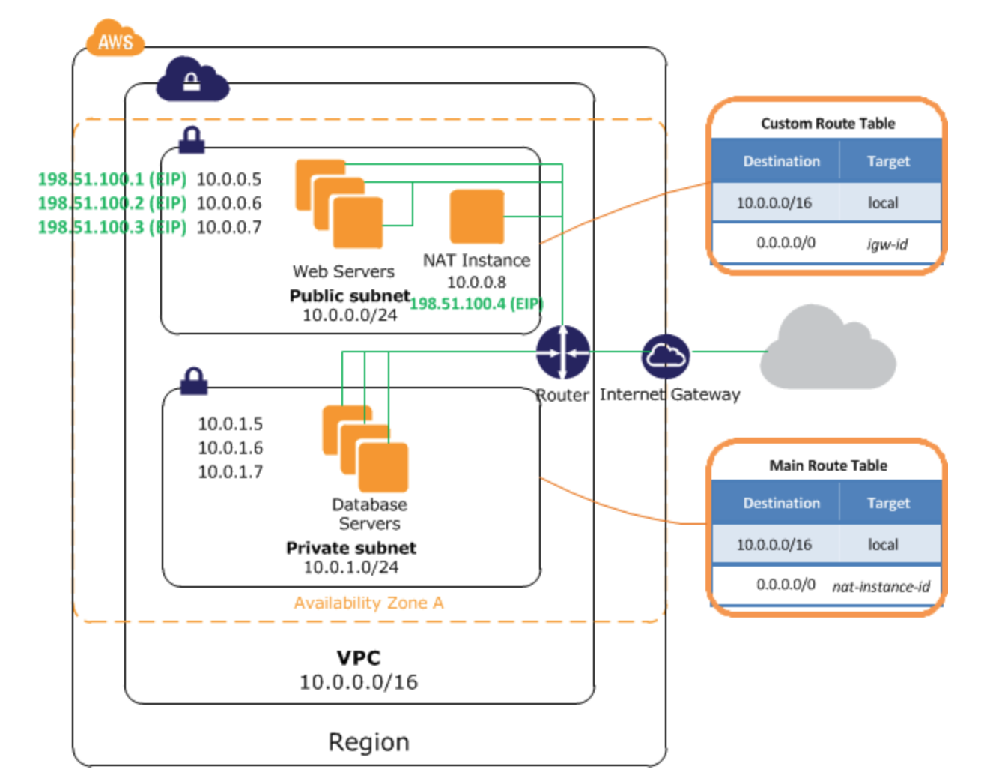

# aws-rust-kubernetes

## Terraform

We are using terraform to create our infrastructure. This will create a custom VCP so that we can put our EKS cluster and other resources in.



Our VPC has has the following characteristics:

- There are two subnets, one private and one public.
- The private subnet is inaccessible to the internet (both in and out).
- The public subnet is accessible; just dependent on the configuration of the security groups. Elastic IPs can be associated with instances in here.
- Instances in the public subnet can access instances in the private subnet (also dependent on security groups) because they’re in the same VPC (this is enabled by the route tables).
- Routing is handled like this:
  - Private subnet is routed through the NAT instance.
  - Public subnet is routed directly to the attached internet gateway.

Terraform needs to be able to access your secret keys, you can either save them within the `~./aws/credentials` file or create `terraform.tfvars` file in the terraform directory within this project and save them there in the following format (the file is .gitignored). The elastic IP's allocation ID is for the NAT gateway, you can grab this from the console > EC2 > Elastic IPs where you can generate a new elastic IP.

```sh
# ./terraform/terraform.tfvars

region      = "us-east-1"
environment = "dev-eks"
aws_access_key = "abcdefgh"
aws_secret_key = "abcdefghabcdefgh"
vpc_cidr             = "10.0.0.0/16"
public_subnets_cidr  = ["10.0.1.0/24"] //List of Public subnet cidr range
private_subnets_cidr = ["10.0.10.0/24"] //List of private subnet cidr range
```

Run this command to ensure that the values in the `terraform.tfvars` are picked up by terraform.

```bash
 terraform validate -var-file=terraform.tfvars
```

Then run
```bash
terraform init
```
```bash
terraform plan
```
```bash
terraform apply
```
